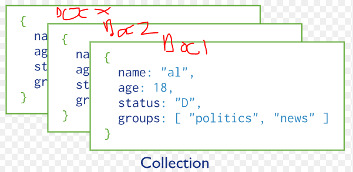
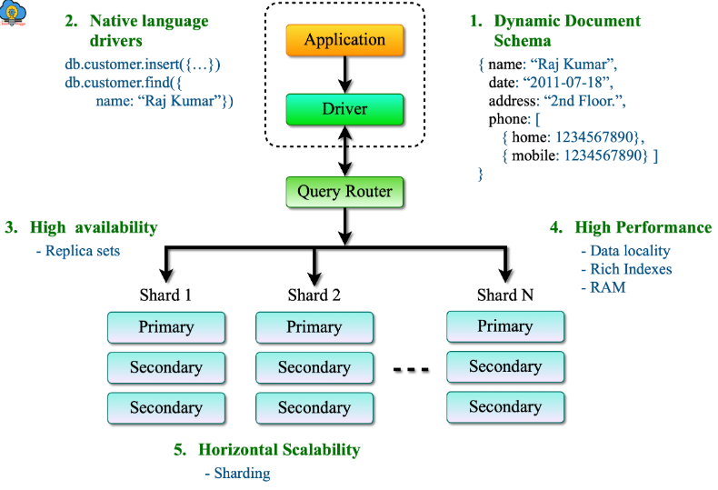
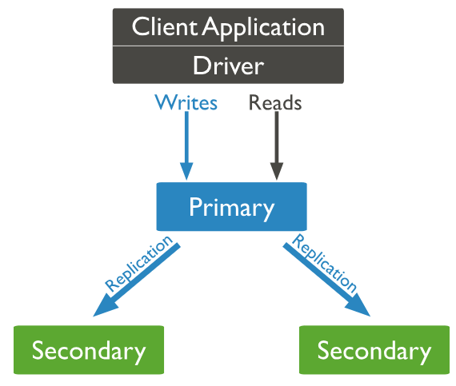
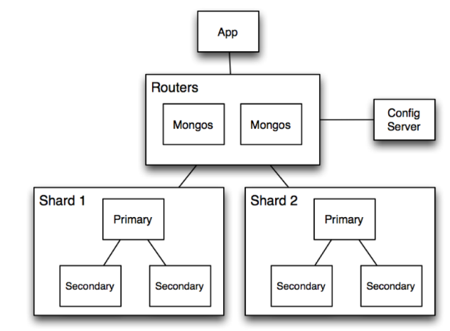
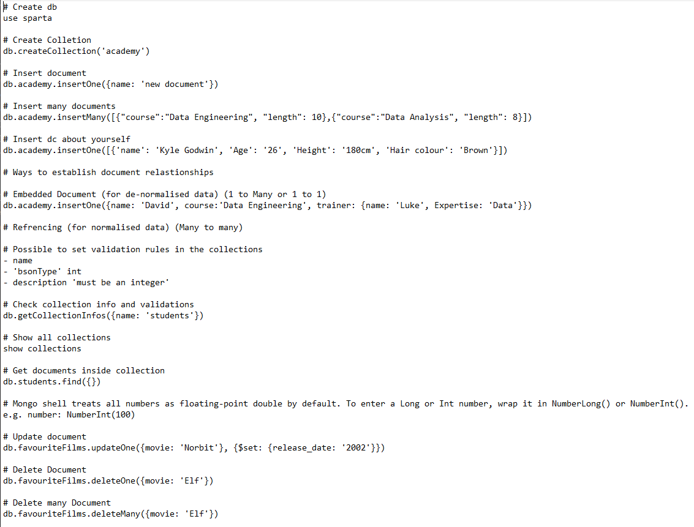

## MongoDB
- MongoDB is a NoSQL document database
- It stores data in BSON (Binary JSON)
- It Offers high performance, horizontal scalability, and schema flexibility

--- 

## Collections and Documents

### Document: 
- A JSON-like object storing data (key-value pairs).
### Collection: 
- A group of documents, like a SQL table.

---

## MongoDB Architecture

### Application & Driver
- Application uses MongoDB driver (e.g., Node.js, Python, Java) to send queries
- Driver handles connection and communication with mongod or mongos

### Mongos: Query router for sharded clusters
- Acts as a router between the application and the cluster
- Determines which shard a query should go to based on the shard key
- Clients only talk to mongos, not directly to shards

### Config servers: Store metadata in sharded setups
- Maintain information about shard distribution and cluster configuration
- Used by mongos to route queries correctly

### Shards: Data storage nodes in a sharded cluster
- Each shard contains a subset of the data
- Typically configured as a replica set for fault tolerance
- Enable horizontal scaling of the database

### Mongod: Primary server daemon
- Stores data on disk
- Listens for client requests (queries, inserts, updates)
- Performs background tasks (indexing, replication, etc.)

### Return Data Flow 
- Query results flow back from `mongod` → `mongos` → driver → application.

---

## Replica Sets

- A group of MongoDB servers that maintain the same data
### Consists of:
- One 'primary' node that handles all writes.
- Multiple 'secondary' nodes that replicate data from the primary.
- Automatic failover if the primary node goes down.

---

## How Replica sets work

- The primary receives all write operations.
- Secondaries replicate the primary’s oplog (operation log) to stay in sync.
- If the primary fails, an election is held to promote a secondary to primary.

---

## Advantages	
- High availability and failover
- Data redundancy and durability
- Read scalability (reads from secondaries)

## Disadvantages
- Replication lag possible
- Slightly more complex setup
- More resource usage

---

## Sharding
- Sharding is MongoDB’s method of horizontal scaling 
- Splitting data across multiple servers (shards)
- Handle large datasets and high throughput.

---

## How Sharding works
- Data is partitioned based on a shard key.
- Each shard holds a subset of data.
- mongos acts as a query router directing queries to appropriate shards.
- Config servers store metadata about the cluster and shard distribution.

---

## Advantages
- Supports large datasets
- Improved read/write throughput
- Horizontal scaling

## Disadvantages
- Complex setup and management
- Choosing correct shard key is critical
- Increased operational overhead

---

## Use Cases

### Lyft (Real-Time Ride Matching)
- Uses MongoDB to store geospatial data and track driver/passenger locations in real-time.  
- Requires high availability and low latency for live ride updates.

### Bosch (IoT Data Storage)
- Collects and analyzes large volumes of IoT sensor data.  
- MongoDB’s horizontal scaling helps manage vast, time-series datasets efficiently.

---

## Today's covered content

