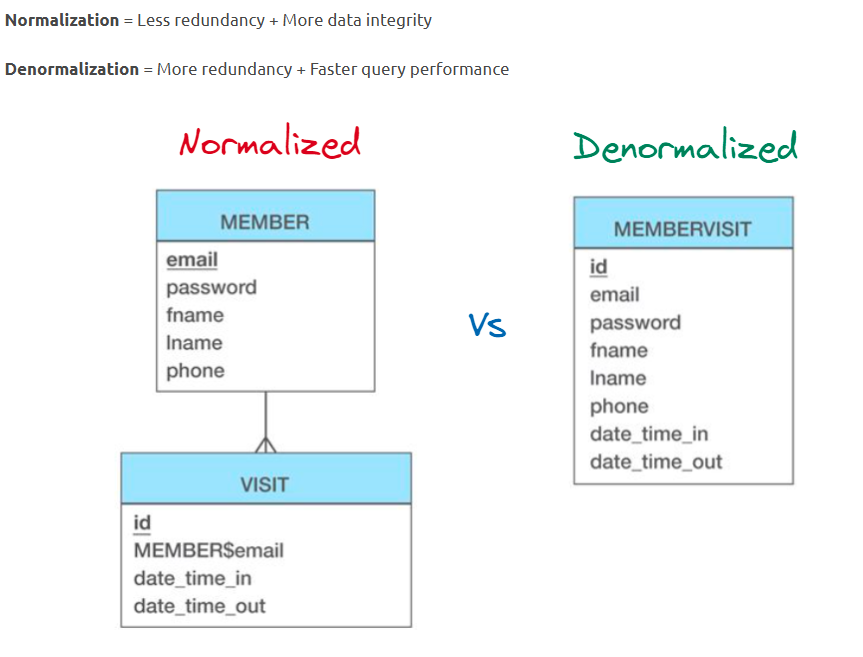
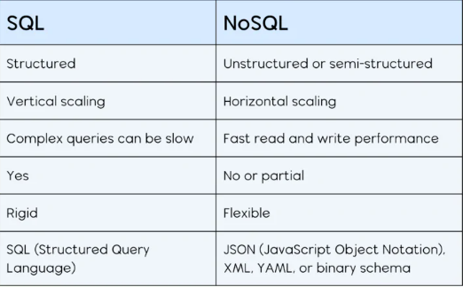
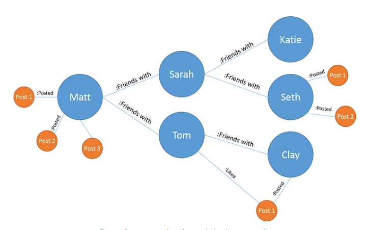

# NoSQL Database Types
- Key value Stores (simple data storage as key:value pairs)
- Document Stores (store structured data as JSON-like documents)
- Column-Family Stores (data stored in rows and columns, but with flexible schemas)
- Graph Databases (designed for handling data with complex relationships)


---

# Querying
```
- insertOne() inserts doc
- insertMany() inserts many docs
- findOne() find one doc
- find() find multi docs
- updateOne()
- updateMany()
- deleteOne()
- deleteMany()
- drop()
- distinct("name")
- aggregate([{match: }, {group: }, {sort: }])
- ```

---

# Operators
```
- $eq equal to
- $gt greater than
- $gte greater than or equal to
- $in in the array
- $lt less than
- $lte less than or equal to
- $ne not equal to
- $nin not in the array
```
---

# Normalisation vs De-normalisation



## Normalisation
- Reduces Redundancy (unnecessary data)
- Improve Data integrity (accuracy and consistency of the data)
- Smaller DB's due to clearance of duplicates
- Better for transaction systems where integrity and update speed are crucial
- Faster writes

## De-Normalisation
- Performance improve due to the need for complex joins
- Faster data reads
- Better for analytical processing where read speed is more important than write speed
- Data available quickly

---

# NoSQL vs SQL



## NoSQL - Reasons
- Flexible schema (no model required)
- Horizontal scalability allowing you to handle increase data volume
- Handle large datasets especially for read operations

## SQL - Reasons
- More Data integrity (accuracy and consistency)
- Less Data redundancy (unnecessary or duplicate data)
- Complex joins and queries to improve analytics

---

# Database scaling
- SQL uses vertical scaling (scales more resources on server)
- NoSQL uses horizontal scaling (add more servers and distribute resources)

---

# Graph Databases
- Type of NoSQL Database
- Read performance stays constant even as data grows
- Very agile, easily adaptable and changeable
- Focuses on the relations between the data



---

# Creating relationships in MongoDB
- Referencing (manually linking using ID) (1 - many relationships)
- Embedding (inserting a document in a document) (1 - 1 relationships)
- Embedding is faster due to data stored inside the document (less query operations)

---

# Mongo Architecture
- Database (holds collections)
- Collections (holds documents)
- Documents (JSON like records)
- MongoDB Server (A mongod process running the database engine)
- Clients (Applications or users interacting with the DB or Mongo Shell)
---

# Replica Sets
- A group of MongoDB servers that maintain the same data
- One primary
- One or more Secondary nodes
- Writes and read go to the primary
- Secondary replicate the primary
- If primary fails, a secondary is chosen to be the new primary

---

# Sharding
- Sharding is used to distribute data across multiple servers (shards)
- A shard is a piece of your overall data
- Splits the data across multiple shards
- Horizontal scaling
- Proving a split or resources across multiple shards

---

# Aggregate
- Used to process data and return computer results
- Consists of a series of stages
- Each stage transforms the data and passes it to the next stage
```
$match - Filters documents (similar to find())
$group - Group documents and apply aggregation (e.g. sum, avg)
---
$project - Include/ exclude reshape fields
$sort
$limit
$lookup - Perform left outer join
$unwind - Deconstruct array
```